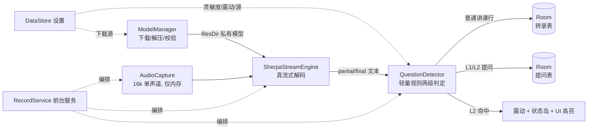

<div align="center">

# 水课帮 · Android

**课堂提问助手 —— 走神也能秒回溯老师的问题**

仿 iOS「水课帮」的 Android 实现：麦克风实时收音 → 设备端**真流式离线语音识别** → 轻量规则检测老师提问 → 震动 / 高亮 / 问题回溯 → 本地存档。

`package = com.star.shuikebang` · minSdk 26 · target/compile 34 · Kotlin + Jetpack Compose


</div>

---

## 目录

- [功能特性](#功能特性)
- [技术栈](#技术栈)
- [整体架构与数据流](#整体架构与数据流)
- [工程目录](#工程目录)
- [快速开始](#快速开始)
- [模型动态下发](#模型动态下发)
- [提问检测规则（可调）](#提问检测规则可调)
- [状态岛四级降级](#状态岛四级降级)
- [设置项](#设置项)
- [测试](#测试)
- [真机自测清单](#真机自测清单)
- [隐私边界（明确不做）](#隐私边界明确不做)
- [已知限制与后续](#已知限制与后续)
- [交接文档](#交接文档)

---

## 功能特性

- **真流式离线识别**：基于 sherpa-onnx Streaming Zipformer（INT8 量化），边说边出字，**全程不需要联网**，音频不出设备、不落地保存。
- **中英双语**：默认 small 双语模型（英语课可用），另提供 25MB 纯中文省流模型。
- **两级提问检测**：纯规则、无大模型，识别「点名 / 让同学回答」的 L1 预警与「疑问句」的 L2 确认，支持四档灵敏度。
- **即时提醒与回溯**：命中 L2 时两段式震动 + 录制页高亮 + 提问列表沉淀，随时复制问题。
- **本地课堂档案**：Room 存储每节课的完整转录与提问，按时间浏览、重命名、删除、复制。
- **模型动态下发**：APK 本体不含模型，首次使用下载到应用私有目录，卸载即清除。
- **多下载源可选**：自动 / ghfast / gh-proxy / GitHub 官方，失败自动回退（国内直连友好）。
- **厂商状态岛适配**：小米超级岛 / vivo 原子岛 → 自绘悬浮胶囊 → 前台常驻通知逐级降级，纯本地通知、**不接入任何 Push**。

## 技术栈

| 领域 | 选型 | 说明 |
|---|---|---|
| 语言 / 构建 | Kotlin 2.0.20、AGP 8.6.1、Gradle 8.10.2、JVM 17 | KSP 注解处理 |
| UI | Jetpack Compose（BOM 2024.09）、Material3 | 单 Activity + Navigation Compose |
| 离线 ASR | `com.github.k2-fsa.sherpa-onnx:sherpa-onnx:v1.13.7`（JitPack） | Streaming Zipformer，真流式 |
| 本地存储 | Room 2.6.1 | 只存文本 / 时间戳，不存音频 |
| 偏好存储 | DataStore Preferences | 设置项持久化 |
| 网络 | OkHttp 4.12 | **仅**用于模型下载，断点续传 |
| 解压 | commons-compress 1.27.1 | zip / tar.bz2 |
| 后台 | LifecycleService + 前台服务（microphone 类型） | 录音保活 |

> **体积说明**：release APK 约 12MB，其中业务 dex 经 R8 后仅约 1MB，绝大部分体积是 onnxruntime / sherpa 的 native 库（`.so` 已在包内压缩）。iOS 原版只有 1.82MB 是因为它直接调用系统 `SFSpeechRecognizer`；Android 没有等价的离线系统能力，必须自带运行时，这是平台差异而非业务膨胀。模型不占包体。

## 整体架构与数据流



核心原则：**音频永远只在内存中流动**；落盘的只有识别后的文字。

## 工程目录

```
app/src/main/java/com/star/shuikebang/
├─ MainActivity.kt / ShuiKeApp.kt        # 单 Activity、应用入口
├─ asr/                                  # 语音识别层
│  ├─ AudioCapture.kt                    #   AudioRecord 采集（音频不落地）
│  ├─ SherpaStreamEngine.kt              #   sherpa-onnx 真流式封装
│  ├─ AsrModels.kt                       #   内置模型清单 / 候选下载源
│  ├─ DownloadSource.kt                  #   下载源选项定义
│  └─ ModelManager.kt                    #   下载、断点续传、解压、sha256
├─ nlp/                                  # 提问检测（纯规则，无模型）
│  ├─ TextNorm.kt / QuestionRules.kt / QuestionDetector.kt
├─ data/
│  ├─ db/                                #   Room：会话 / 转录 / 提问三表
│  └─ prefs/SettingsRepository.kt        #   DataStore 设置
├─ service/                              # RecordService 编排 + RecSession 状态
├─ island/                               # 厂商岛 / 悬浮胶囊 / 前台通知
├─ feedback/Hapticx.kt                   # 震动
├─ perm/                                 # 麦克风 / 电池优化引导
├─ util/                                 # 剪贴板、时间格式化
└─ ui/                                   # Compose 界面
   ├─ idle/        首页（开始 / 模型 / 历史 / 设置入口）
   ├─ model/       模型下载与下载源选择
   ├─ record/      录制页（实时转录 + 提问卡 + 底部操作）
   ├─ history/     历史列表 / 会话详情
   ├─ settings/    设置页
   ├─ component/   复用组件（状态条、提问卡、操作坞）
   └─ theme/       设计令牌（颜色 / 字体 / 主题）
```

## 快速开始

### 1. 环境要求

- JDK 17+（开发机使用 JDK 21 验证通过）
- Android SDK：`compileSdk = targetSdk = 34`，`minSdk = 26`
- 在项目根目录创建 `local.properties`（已被 .gitignore 忽略）：

```properties
sdk.dir=D\:\\apps\\AndroidSDK
```

### 2. 依赖镜像与代理（国内网络）

- Maven 依赖已在 `settings.gradle.kts` 配置阿里云 google/central 镜像 + JitPack；
- Gradle distribution 走腾讯云镜像（`gradle/wrapper/gradle-wrapper.properties`）；
- 如需本地代理，见 `gradle.properties` 末尾的 `systemProp.*.proxyHost=127.0.0.1` / `proxyPort=7897`，不用可删除；`nonProxyHosts` 已放行国内镜像。

### 3. 构建

```powershell
# Debug：arm64-v8a + x86_64（可跑模拟器）
.\gradlew.bat :app:assembleDebug

# Release：仅 arm64-v8a，R8 + 资源压缩 + so 压缩（当前用 debug 签名，可直接装机）
.\gradlew.bat :app:assembleRelease

# 单元测试
.\gradlew.bat :app:testDebugUnitTest
```

产物路径：

| 产物 | 路径 | 用途 |
|---|---|---|
| release | `app/build/outputs/apk/release/app-release.apk`（约 12MB） | 真机安装 |
| debug | `app/build/outputs/apk/debug/app-debug.apk` | 模拟器（含 x86_64） |

> Release 默认只打 `arm64-v8a`（覆盖 2019 年后绝大多数真机）；需要老架构在 `app/build.gradle.kts` 的 `abiFilters` 加回 `armeabi-v7a`。正式上架前需替换为自有 keystore。

## 模型动态下发

模型**不打进 APK**，由本仓库自己的 GitHub Release（tag `asr-models-v1`）分发，只含运行所需的 INT8 四件套：

| 模型 | 适用 | zip 体积 | 解压后 |
|---|---|---|---|
| Streaming Zipformer small（**默认**） | 中英双语 | 50 MB | ≈57 MB |
| Streaming Zipformer zh-14M | 纯中文、省流 | 25.5 MB | ≈29.5 MB |

四件套命名固定：`encoder-*.int8.onnx`、`decoder-*.onnx`（fp32）、`joiner-*.int8.onnx`、`tokens.txt`，zip 为**扁平结构**（解压即四文件，故 `AsrModelSpec.innerDir = ""`）。

- 下载到 `filesDir/models/<modelId>/`，应用私有目录、无需存储权限，卸载随 App 清除。
- 支持断点续传（`.part`）、多源失败自动回退、可选 sha256 校验。
- **网络实测**：GitHub Release 直连在国内会超时；`ghfast.top` / `gh-proxy.com` 公共镜像不走代理可直连，因此默认「镜像优先、官方兜底」。
- **迁移到 Cloudflare R2 / 自建对象存储**：只改 `asr/AsrModels.kt` 中 `BuiltinModels` 的 `archiveUrl / mirrorUrls / sizeBytes`，以及 `DownloadSource.kt` 的源列表，其余代码无需改动。

## 提问检测规则（可调）

检测刻意保持「轻量规则、无大模型」，避免体积与算力膨胀。规则集中在 `nlp/QuestionRules.kt`，判定在 `nlp/QuestionDetector.kt`：

- **强疑问结构**（`ZH_STRONG`，如「什么是 / 为什么 / 哪位 / 是什么」）：命中即较可信；
- **次强结构**（`ZH_STRONG_SOFT`，如「如何」，保守档不判）；
- **弱疑问词**（`ZH_WEAK`，如「什么 / 怎么 / 几个 / 是不是」）：讲课中也高频出现，**单独不判**，需句末语气词 / 点名短语 / 位于句首或句末等旁证；
- **讲课框架词**（`ZH_LECTURE`，如「下面我们 / 区别在于 / 分为」）：命中后否决弱信号（不影响强信号），专治「下面讲几个概念」这类误报；
- **点名短语**分硬 / 软两档（`ZH_CALL_STRONG / ZH_CALL_WEAK`），对应 L1 预警。

四档灵敏度（设置页可调）：

| 档位 | 行为 |
|---|---|
| 灵敏 HIGH | 弱词也判，宁多勿漏；软祈使也给 L1 |
| 均衡 NORMAL（默认） | 强信号 + 有旁证的弱信号 |
| 保守 LOW | 只认问号 / 句末「吗」/ 核心强结构 |
| 关闭 OFF | 只转写，完全不检测、不提醒 |

> 调整误报 / 漏报时，先在 `QuestionRules.kt` 增删词表，再到 `app/src/test/.../QuestionDetectorTest.kt` 补对应用例（已内置一批「讲课句不得误报」反例），跑 `testDebugUnitTest` 守护。

## 状态岛四级降级

`island/StatusIsland.kt` 统一门面，录制状态按可用性逐级降级，全部为**本地**能力，不依赖推送：

1. **L0 应用内胶囊**：录制页 Compose 状态条，始终可用；
2. **L1 厂商原生岛**：小米超级岛 / vivo 原子岛（`VendorIslandNotifier`，本地通知 extras 实现）；
3. **L2 自绘悬浮胶囊**：`OverlayCapsule`，需悬浮窗权限，设置中手动开启，默认关闭；
4. **L3 前台常驻通知**：`FgsNotifier`，录音合规要求，始终存在。

## 设置项

`ui/settings/SettingsScreen.kt` + DataStore 持久化：

- 提问检测灵敏度（灵敏 / 均衡 / 保守 / 关闭）
- 是否保留 L1「可能被提问」预警
- 检测到提问时是否震动
- 是否启用悬浮状态胶囊（开启时引导授予悬浮窗权限）
- 模型下载源（自动 / ghfast / gh-proxy / GitHub 官方）

## 测试

```powershell
.\gradlew.bat :app:testDebugUnitTest
```

当前单测聚焦最易出错的提问检测：正向疑问句、点名 L1、核心问题剥除、**讲课陈述反例（不得误报）**、弱词旁证、四档灵敏度差异、中英文本归一。

## 真机自测清单

1. 安装 release 包，授予麦克风、通知权限，按引导将 App 加入电池优化白名单（国产 ROM 杀后台重灾区）。
2. 首次点「开始记录」→ 在模型页选择下载源并下载模型（仅这一步联网，建议 WiFi）。
3. 说出「什么是线性回归？」「哪位同学来回答一下」「下面我们讲几个概念」（最后一句**不应**误报），观察：
   - 转录是否流式刷新；问句是否震动、高亮、进入提问列表；讲课句是否被正确放过；
4. 停止后进入「历史」，打开会话查看完整转录与提问、复制文本（重点回归：含提问的会话详情不再闪退）。
5. 切后台 / 锁屏，验证前台服务保活与状态岛 / 通知展示。
6. 在「设置」中切换灵敏度、关闭震动、切换下载源后重新录制验证生效。

## 隐私边界（明确不做）

对齐 iOS 原版的产品红线，**不做**以下功能，避免体积与复杂度膨胀：

- ❌ 不保存原始录音（只存识别后的文字）
- ❌ 不导入外部音频文件转写（仅麦克风实时流）
- ❌ 无 AI 总结 / 问答 / 思维导图（「问 AI」按钮仅调起系统分享面板 ACTION_SEND）
- ❌ 无云同步、无账号登录（除模型下载外无任何网络请求）
- ❌ 无广告、无社区、无分享 Feed

## 已知限制与后续

- 小米超级岛 / vivo 原子岛的通知 extras 按公开文档实现，**尚待目标真机校准**（建议 HyperOS 小米 14/15、OriginOS 4/5 vivo 机型）；不支持时自动降级 L3 通知，功能不受影响。
- Release 当前复用 debug 签名，正式上架需配置自有 keystore。
- 仅 arm64-v8a；老架构按需放开 ABI。
- 后续可选项：watchOS 对应能力在 Android 为手表通知（暂未做）、平板横竖屏自适应。

## 交接文档

继续开发 / 接手前请先读仓库根目录的 **[`HANDOVER.md`](./HANDOVER.md)**，其中记录了：开发环境与构建命令、模型 Release 与 sha256、关键技术决策与踩坑记录、真机待办、以及外部参考链接。
